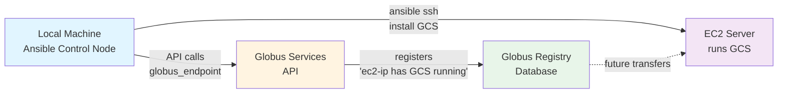

# Manual Testing Guide

This guide walks you through manually testing the Ansible Globus Collection in a realistic development environment: your local machine + remote EC2 instances.

## 🏗️ Testing Architecture

**Development Setup:**
- 🖥️ **Local host**: Development, Ansible control node, API calls to Globus
- ☁️ **EC2 instance(s)**: GCS software installation, data storage
- 🌐 **Globus services**: Central registry and API endpoints

## 🔑 Key Architectural Concept

**This collection is different from typical Ansible modules:**

```yaml
# Traditional modules install/configure ON remote hosts
- hosts: webservers        # Targets: remote servers
  tasks:
    - name: Install nginx   # Installs ON each webserver
      package: name=nginx

# Globus modules make API calls FROM your control node
- hosts: localhost         # Target: your local machine (control node)
  tasks:
    - name: Create endpoint # Calls Globus API FROM your local machine
      globus_endpoint:      # Registers a remote server WITH Globus
        hostname: "ec2-ip"  # Points TO your EC2 server
```

**Two-step process:**
1. **Install GCS software** → `hosts: globus_servers` (ON remote servers)
2. **Register with Globus** → `hosts: localhost` (API calls FROM local machine)



## 🚀 Quick Start

### 1. Install Collection on Local Machine

```bash
# From the project directory on your local machine
uv run ansible-galaxy collection build
uv run ansible-galaxy collection install community-globus-1.0.0.tar.gz --force

# Or install in development mode (recommended for active development)
mkdir -p ~/.ansible/collections/ansible_collections/community
ln -s $(pwd) ~/.ansible/collections/ansible_collections/community/globus
```

### 2. Set Up Globus Credentials

You'll need a Globus application for testing:

1. **Create a Globus Application**:
   - Go to https://developers.globus.org
   - Click "Add new app"
   - Choose "Confidential Client"
   - Set redirect URL to `https://example.com` (not used for client credentials)
   - Note your Client ID and generate a Client Secret

2. **Set Environment Variables**:
   ```bash
   export GLOBUS_CLIENT_ID="your-client-id"
   export GLOBUS_CLIENT_SECRET="your-client-secret"
   export GLOBUS_SDK_ENVIRONMENT="sandbox"  # Use sandbox for testing
   ```

### 3. Set Up EC2 Test Instance

**Launch EC2 instance for GCS:**
```bash
# Example AWS CLI command (adjust to your needs)
aws ec2 run-instances \
  --image-id ami-0c02fb55956c7d316 \  # Amazon Linux 2023
  --instance-type t3.medium \
  --key-name your-keypair \
  --security-groups globus-test-sg \
  --tag-specifications 'ResourceType=instance,Tags=[{Key=Name,Value=globus-test}]'
```

**Security Group Requirements:**
- SSH (port 22) from your IP
- HTTP/HTTPS (80/443) for Globus web interface
- Globus data ports (2811, 50000-51000) if doing transfers

**Install GCS on EC2** (run on the instance):
```bash
# Install GCS (Amazon Linux 2023 example)
sudo yum update -y
sudo yum install -y python3 pip
sudo pip3 install globus-connect-server
```

### 4. Inventory Setup

Create `inventory.ini`:
```ini
[globus_servers]
ec2-test ansible_host=YOUR_EC2_IP ansible_user=ec2-user ansible_ssh_private_key_file=~/.ssh/your-key.pem

[globus_servers:vars]
ansible_python_interpreter=/usr/bin/python3
```

### 5. Basic Test Playbook

Create `test_globus.yml`:

```yaml
---
- name: Test Globus Collection from Local Machine to EC2
  hosts: localhost
  connection: local
  gather_facts: false

  vars:
    # Use your actual client credentials
    globus_client_id: "{{ ansible_env.GLOBUS_CLIENT_ID }}"
    globus_client_secret: "{{ ansible_env.GLOBUS_CLIENT_SECRET }}"

  tasks:
    - name: Test endpoint management (list only - safe)
      community.globus.globus_endpoint:
        name: "test-endpoint-{{ ansible_date_time.epoch }}"
        state: present
        auth_method: client_credentials
        client_id: "{{ globus_client_id }}"
        client_secret: "{{ globus_client_secret }}"
      register: endpoint_result
      ignore_errors: yes

    - name: Display endpoint result
      debug:
        var: endpoint_result
```

Run it:
```bash
ansible-playbook test_globus.yml
```

## 📋 Comprehensive Test Scenarios

### Test 1: Authentication Verification

```yaml
---
- name: Test Authentication Methods
  hosts: localhost
  connection: local
  gather_facts: false

  vars:
    globus_client_id: "{{ ansible_env.GLOBUS_CLIENT_ID }}"
    globus_client_secret: "{{ ansible_env.GLOBUS_CLIENT_SECRET }}"

  tasks:
    # Test 1: Client Credentials Auth
    - name: Test client credentials authentication
      community.globus.globus_endpoint:
        name: "auth-test-{{ ansible_date_time.epoch }}"
        state: present
        auth_method: client_credentials
        client_id: "{{ globus_client_id }}"
        client_secret: "{{ globus_client_secret }}"
        check_mode: yes  # Safe - won't create anything
      register: auth_test

    - name: Verify authentication worked
      assert:
        that:
          - not auth_test.failed
        fail_msg: "Client credentials authentication failed"

    # Test 2: CLI Auth (if you have globus CLI installed)
    - name: Test CLI authentication
      community.globus.globus_endpoint:
        name: "cli-auth-test-{{ ansible_date_time.epoch }}"
        state: present
        auth_method: cli
        check_mode: yes
      register: cli_auth_test
      ignore_errors: yes

    - name: Display CLI auth result
      debug:
        msg: "CLI auth {{ 'succeeded' if not cli_auth_test.failed else 'failed (expected if not logged in)' }}"
```

### Test 2: Endpoint Operations

```yaml
---
- name: Test Endpoint CRUD Operations
  hosts: localhost
  connection: local
  gather_facts: false

  vars:
    globus_client_id: "{{ ansible_env.GLOBUS_CLIENT_ID }}"
    globus_client_secret: "{{ ansible_env.GLOBUS_CLIENT_SECRET }}"
    test_endpoint_name: "ansible-test-{{ ansible_date_time.epoch }}"

  tasks:
    - name: Create test endpoint
      community.globus.globus_endpoint:
        name: "{{ test_endpoint_name }}"
        description: "Ansible test endpoint - safe to delete"
        organization: "Test Organization"
        contact_email: "test@example.com"
        state: present
        auth_method: client_credentials
        client_id: "{{ globus_client_id }}"
        client_secret: "{{ globus_client_secret }}"
      register: create_result

    - name: Display creation result
      debug:
        var: create_result

    - name: Verify endpoint exists (idempotency test)
      community.globus.globus_endpoint:
        name: "{{ test_endpoint_name }}"
        description: "Ansible test endpoint - safe to delete"
        organization: "Test Organization"
        contact_email: "test@example.com"
        state: present
        auth_method: client_credentials
        client_id: "{{ globus_client_id }}"
        client_secret: "{{ globus_client_secret }}"
      register: idempotent_result

    - name: Verify idempotency
      assert:
        that:
          - not idempotent_result.changed
        fail_msg: "Module is not idempotent"

    - name: Clean up - delete test endpoint
      community.globus.globus_endpoint:
        name: "{{ test_endpoint_name }}"
        state: absent
        auth_method: client_credentials
        client_id: "{{ globus_client_id }}"
        client_secret: "{{ globus_client_secret }}"
      register: delete_result

    - name: Verify deletion
      assert:
        that:
          - delete_result.changed
        fail_msg: "Endpoint deletion failed"
```

### Test 3: Group Operations

```yaml
---
- name: Test Group Operations
  hosts: localhost
  connection: local
  gather_facts: false

  vars:
    globus_client_id: "{{ ansible_env.GLOBUS_CLIENT_ID }}"
    globus_client_secret: "{{ ansible_env.GLOBUS_CLIENT_SECRET }}"
    test_group_name: "ansible-test-group-{{ ansible_date_time.epoch }}"

  tasks:
    - name: Create test group
      community.globus.globus_group:
        name: "{{ test_group_name }}"
        description: "Ansible test group - safe to delete"
        state: present
        auth_method: client_credentials
        client_id: "{{ globus_client_id }}"
        client_secret: "{{ globus_client_secret }}"
      register: group_result

    - name: Display group creation result
      debug:
        var: group_result

    - name: Clean up - delete test group
      community.globus.globus_group:
        name: "{{ test_group_name }}"
        state: absent
        auth_method: client_credentials
        client_id: "{{ globus_client_id }}"
        client_secret: "{{ globus_client_secret }}"
      when: group_result.changed
```

### Test 4: Error Handling

```yaml
---
- name: Test Error Handling
  hosts: localhost
  connection: local
  gather_facts: false

  tasks:
    # Test invalid credentials
    - name: Test invalid credentials
      community.globus.globus_endpoint:
        name: "error-test"
        state: present
        auth_method: client_credentials
        client_id: "invalid-id"
        client_secret: "invalid-secret"
      register: invalid_creds
      ignore_errors: yes

    - name: Verify error handling
      assert:
        that:
          - invalid_creds.failed
        fail_msg: "Should have failed with invalid credentials"

    # Test missing required parameters
    - name: Test missing parameters
      community.globus.globus_endpoint:
        state: present
        auth_method: client_credentials
        client_id: "test"
        # Missing name parameter
      register: missing_params
      ignore_errors: yes

    - name: Verify parameter validation
      assert:
        that:
          - missing_params.failed
        fail_msg: "Should have failed with missing required parameter"
```

## 🔧 Troubleshooting

### Common Issues

1. **Module Not Found**:
   ```bash
   # Verify installation
   ansible-galaxy collection list | grep globus

   # Check path
   ls -la ~/.ansible/collections/ansible_collections/community/globus/
   ```

2. **Authentication Errors**:
   ```bash
   # Verify credentials
   echo $GLOBUS_CLIENT_ID
   echo $GLOBUS_CLIENT_SECRET

   # Test manually with curl
   curl -X POST https://auth.globus.org/v2/oauth2/token \
        -H "Content-Type: application/x-www-form-urlencoded" \
        -u "$GLOBUS_CLIENT_ID:$GLOBUS_CLIENT_SECRET" \
        -d "grant_type=client_credentials&scope=urn:globus:auth:scope:transfer.api.globus.org:all"
   ```

3. **Permission Denied (403)**:
   - Your client application needs admin privileges on your Globus project
   - Go to https://app.globus.org/settings/developers
   - Add your client application as an admin

### Debug Mode

Run with maximum verbosity:
```bash
ansible-playbook test_globus.yml -vvv
```

### Check Module Logs

```yaml
- name: Enable debug logging
  community.globus.globus_endpoint:
    name: "debug-test"
    state: present
    auth_method: client_credentials
    client_id: "{{ globus_client_id }}"
    client_secret: "{{ globus_client_secret }}"
  environment:
    ANSIBLE_DEBUG: 1
```

## 🧪 Advanced Testing

### Performance Testing

```yaml
---
- name: Performance Test
  hosts: localhost
  connection: local
  gather_facts: false

  vars:
    globus_client_id: "{{ ansible_env.GLOBUS_CLIENT_ID }}"
    globus_client_secret: "{{ ansible_env.GLOBUS_CLIENT_SECRET }}"

  tasks:
    - name: Create multiple endpoints (performance test)
      community.globus.globus_endpoint:
        name: "perf-test-{{ item }}-{{ ansible_date_time.epoch }}"
        state: present
        auth_method: client_credentials
        client_id: "{{ globus_client_id }}"
        client_secret: "{{ globus_client_secret }}"
      loop: "{{ range(1, 6) | list }}"  # Create 5 endpoints
      register: perf_results

    - name: Display timing information
      debug:
        msg: "Created {{ perf_results.results | length }} endpoints"

    - name: Clean up performance test endpoints
      community.globus.globus_endpoint:
        name: "perf-test-{{ item }}-{{ ansible_date_time.epoch }}"
        state: absent
        auth_method: client_credentials
        client_id: "{{ globus_client_id }}"
        client_secret: "{{ globus_client_secret }}"
      loop: "{{ range(1, 6) | list }}"
```

### Full EC2 + GCS Deployment Workflow

This shows the proper multi-host approach:

```yaml
---
# Play 1: Install and configure GCS software ON the EC2 instance
- name: Install GCS on EC2 servers
  hosts: globus_servers
  become: yes
  gather_facts: true

  tasks:
    - name: Install GCS package
      pip:
        name: globus-connect-server
        state: present

    - name: Create test data directory
      file:
        path: /home/ec2-user/test-data
        state: directory
        owner: ec2-user
        group: ec2-user
        mode: '0755'

    - name: Create sample test files
      copy:
        content: |
          This is test file {{ item }}.
          Created for Globus testing.
          Timestamp: {{ ansible_date_time.iso8601 }}
        dest: /home/ec2-user/test-data/test-file-{{ item }}.txt
        owner: ec2-user
        group: ec2-user
        mode: '0644'
      loop: [1, 2, 3]

# Play 2: Register endpoint with Globus API FROM your local machine
- name: Register endpoints with Globus API
  hosts: localhost
  connection: local
  gather_facts: false

  vars:
    globus_client_id: "{{ ansible_env.GLOBUS_CLIENT_ID }}"
    globus_client_secret: "{{ ansible_env.GLOBUS_CLIENT_SECRET }}"

  tasks:
    # Create endpoint pointing to each EC2 server
    - name: Create Globus endpoint for each server
      community.globus.globus_endpoint:
        name: "{{ hostvars[item]['ansible_hostname'] }}-gcs"
        description: "GCS endpoint for {{ hostvars[item]['ansible_hostname'] }}"
        organization: "Development Testing"
        contact_email: "dev@example.com"
        hostname: "{{ hostvars[item]['ansible_default_ipv4']['address'] }}"
        public: true
        state: present
        auth_method: client_credentials
        client_id: "{{ globus_client_id }}"
        client_secret: "{{ globus_client_secret }}"
      loop: "{{ groups['globus_servers'] }}"
      register: gcs_endpoints

    - name: Display endpoint information
      debug:
        msg: |
          Created endpoint: {{ gcs_endpoint.name }}
          Endpoint ID: {{ gcs_endpoint.endpoint_id }}
          Setup URL: https://app.globus.org/console/endpoints/{{ gcs_endpoint.endpoint_id }}/overview

    # Step 2: Create collections (from local machine)
    - name: Create test data collection
      community.globus.globus_collection:
        name: "Test Data"
        endpoint_id: "{{ gcs_endpoint.endpoint_id }}"
        path: "/home/ec2-user/test-data"
        collection_type: mapped
        description: "Test data collection for development"
        public: false
        organization: "Development Testing"
        contact_email: "dev@example.com"
        state: present
        auth_method: client_credentials
        client_id: "{{ globus_client_id }}"
        client_secret: "{{ globus_client_secret }}"
      register: test_collection

    - name: Display collection information
      debug:
        msg: |
          Created collection: {{ test_collection.name }}
          Collection UUID: {{ test_collection.collection_id }}
          Access URL: https://app.globus.org/file-manager?origin_id={{ test_collection.collection_id }}

# Second play: Configure the EC2 instance itself
- name: Configure EC2 instance for GCS
  hosts: globus_servers  # From inventory.ini
  become: yes
  gather_facts: true

  vars:
    globus_endpoint_id: "{{ hostvars['localhost']['gcs_endpoint']['endpoint_id'] }}"

  tasks:
    - name: Create test data directory
      file:
        path: /home/ec2-user/test-data
        state: directory
        owner: ec2-user
        group: ec2-user
        mode: '0755'

    - name: Create sample test files
      copy:
        content: |
          This is test file {{ item }}.
          Created for Globus testing.
          Timestamp: {{ ansible_date_time.iso8601 }}
        dest: /home/ec2-user/test-data/test-file-{{ item }}.txt
        owner: ec2-user
        group: ec2-user
        mode: '0644'
      loop: [1, 2, 3]

    - name: Display GCS configuration info
      debug:
        msg: |
          EC2 Instance: {{ ansible_hostname }}
          IP Address: {{ ansible_default_ipv4.address }}
          Endpoint ID: {{ globus_endpoint_id }}

          Next Steps:
          1. SSH to this instance: ssh -i ~/.ssh/your-key.pem ec2-user@{{ ansible_default_ipv4.address }}
          2. Complete GCS setup: sudo globus-connect-server endpoint setup {{ globus_endpoint_id }}
          3. Test file access via Globus web interface
```

**Run the full deployment:**
```bash
# From your local machine
ansible-playbook -i inventory.ini test_ec2_gcs.yml
```

### EC2 Instance Post-Setup

After running the playbook, complete the GCS setup on your EC2 instance:

```bash
# SSH to your EC2 instance
ssh -i ~/.ssh/your-key.pem ec2-user@YOUR_EC2_IP

# Complete GCS setup (run on EC2)
sudo globus-connect-server endpoint setup YOUR_ENDPOINT_ID
sudo systemctl enable globus-connect-server
sudo systemctl start globus-connect-server

# Verify it's running
sudo systemctl status globus-connect-server
sudo globus-connect-server endpoint show
```

## 📊 Test Results

After running tests, you should see:
- ✅ Successful authentication
- ✅ Endpoint creation/deletion working
- ✅ Idempotent operations (no changes on second run)
- ✅ Proper error handling for invalid inputs
- ✅ Clean JSON output from modules

## 🔐 High-Assurance Authentication Tests

Some operations require **high-assurance authentication** (MFA within the last 30 minutes):
- Creating OAuth clients
- Deleting projects
- Deleting clients

These tests are marked with `@pytest.mark.high_assurance` and are **skipped in CI** because automated tokens don't have recent MFA sessions.

### Running High-Assurance Tests Locally

**Prerequisites:**
1. Authenticate with MFA within the last 30 minutes
2. Set up environment variables as shown in the integration test setup

**Run only high-assurance tests:**
```bash
# Ensure you've authenticated recently (within 30 min)
globus login

# Run with proper authentication
aws-vault exec globus-dev -- sh -c '
export GLOBUS_ADMIN_IDS="your-admin-uuid"
export S3_TOKEN_BUCKET="your-bucket"
export S3_TOKEN_KEY="globus/ci-tokens.json"
export S3_TOKEN_NAMESPACE="ci"
export GLOBUS_CLIENT_ID="your-client-id"
export GLOBUS_SDK_ENVIRONMENT="test"
pytest tests/integration/ -v -m high_assurance
'
```

**Run all tests except high-assurance (like CI):**
```bash
pytest tests/integration/ -v -m "not high_assurance"
```

**Run all tests including high-assurance:**
```bash
pytest tests/integration/ -v
```

### Available Test Markers

- `unit` - Unit tests (no external dependencies)
- `integration` - Integration tests requiring live Globus services
- `e2e` - End-to-end tests
- `slow` - Slow running tests
- `high_assurance` - Tests requiring MFA within 30 minutes

## 🚀 Next Steps

Once basic testing works:
1. Test with your real Globus infrastructure
2. Create collections on your endpoints
3. Set up groups and permissions
4. Integrate with your configuration management
5. Run high-assurance tests locally to verify deletion operations work

Happy testing! 🧪
